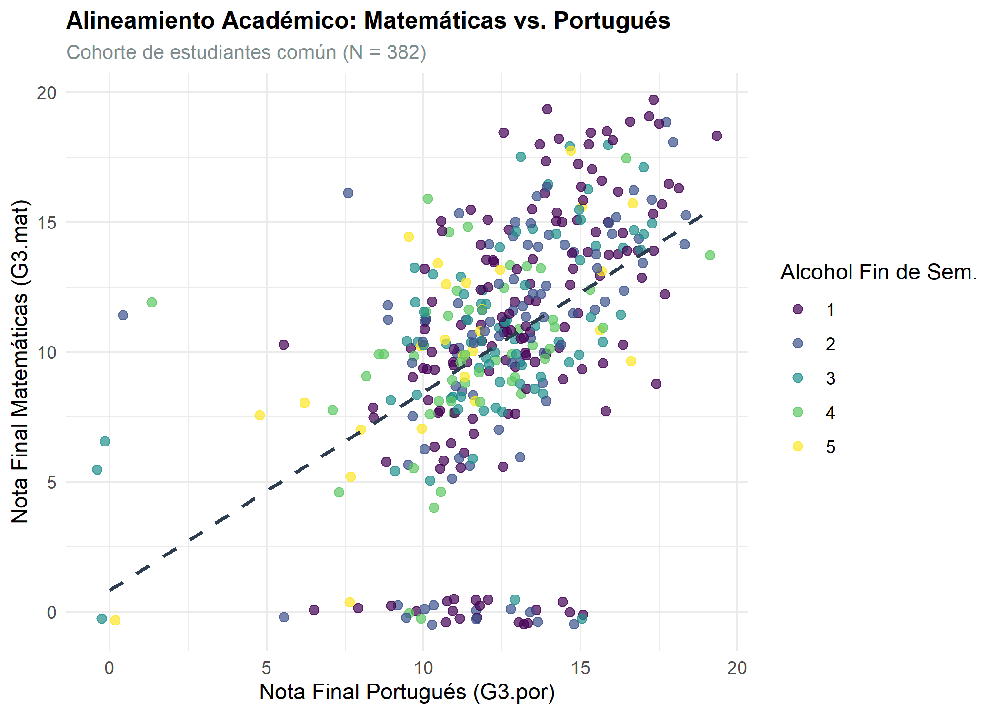
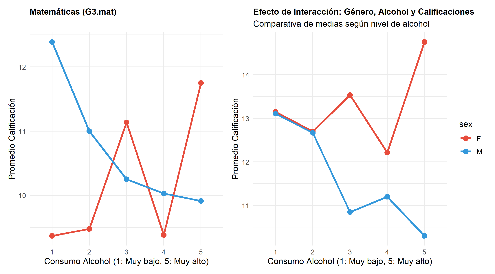
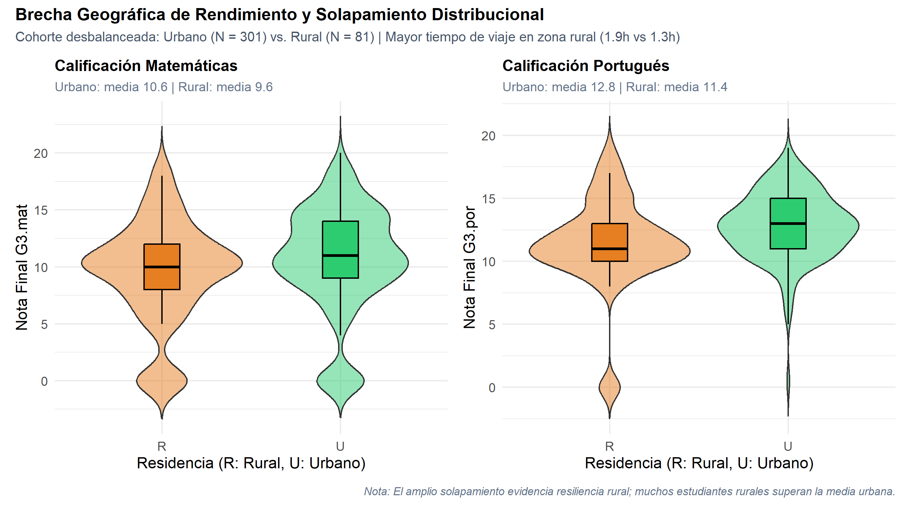
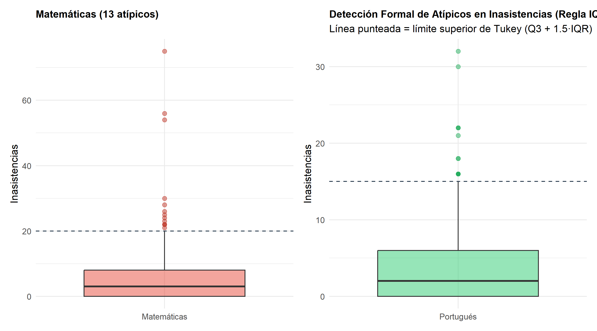

## 01. Introducción y Pregunta de Investigación {.smaller}

  [\[0:00 - 0:28 | 28s\]]{.time-badge}
  [Tema 3 Oficial]{.tag-badge}
  [Cohorte Unificada N = 382]{.tag-badge}
  [Límite: 150 segundos]{.tag-badge}

::::: {.columns}

:::: {.column width="56%"}
::: {.contrast-card}
[Pregunta Central de Investigación]{.text-cyan style="font-size: 1.2em; font-weight: 700; display: block; margin-bottom: 8px;"}

[«¿Cómo se relacionan el **consumo de alcohol** y la **zona de residencia** con las calificaciones y las inasistencias, y qué tan distinto es este patrón entre **hombres y mujeres**?»]{.lead-p}
:::

::: {.contrast-card-emerald}
[Objetivos del Estudio]{.text-emerald style="font-size: 1.2em; font-weight: 700; display: block; margin-bottom: 8px;"}

- **Analizar** la relación entre hábitos de consumo (Walc) y rendimiento académico final ($G3$).
- **Comparar** la brecha de rendimiento urbano-rural y el impacto del tiempo de viaje.
- **Determinar** la existencia de valores atípicos severos en el ausentismo escolar.
:::
::::

:::: {.column width="44%"}
::: {.contrast-card-accent}
[Dimensiones de la Cohorte]{.text-amber style="font-size: 1.2em; font-weight: 700; display: block; margin-bottom: 8px;"}

- **Población estudiada:** $N = 382$ estudiantes de secundaria evaluados simultáneamente en Matemáticas y Portugués.
- **Variables cuantitativas ($\ge 2$):**
  - [Calificaciones ($G3_{\text{mat}}, G3_{\text{por}}$)]{.text-cyan} e [Inasistencias ($\text{absences}$)]{.text-cyan}.
- **Variables cualitativas ($\ge 2$):**
  - [Consumo alcohol fin de semana ($\text{Walc}$)]{.text-amber}, [Sexo]{.text-amber} y [Zona residencial ($\text{address}$)]{.text-amber}.
:::
::::

:::::

::: {.notes}
Saludos. Este análisis explora el impacto del estilo de vida en el rendimiento académico, usando una cohorte común de 382 estudiantes de matemáticas y lengua portuguesa. La pregunta que guía el estudio es: ¿cómo se relacionan el consumo de alcohol y la zona de residencia con las calificaciones y las inasistencias, y qué tan distinto es este patrón entre hombres y mujeres?
:::

---

## 02. Rigor del Diseño Intra-Sujeto {.smaller}

  [\[0:28 - 0:50 | 22s\]]{.time-badge}
  [Metodología Cortez & Silva (2008)]{.tag-badge}
  [Control de Confusión]{.tag-badge}

[Estrategia metodológica para aislar el efecto de hábitos personales controlando factores socioeconómicos y biológicos.]{.lead-p}

 

::::: {.columns}

:::: {.column width="33%"}
::: {.contrast-card style="min-height: 460px;"}
[1. Cruce Determinista]{.text-cyan style="font-size: 1.15em; font-weight: 700; display: block; margin-bottom: 8px;"}

- Metodología de **Cortez & Silva (2008)**.
- Cruce por **13 atributos demográficos** idénticos: `school`, `sex`, `age`, `address`, `famsize`, `Pstatus`, `Medu`, `Fedu`, `Mjob`, `Fjob`, `reason`, `nursery`, `internet`.
- Cohorte común exacta de **$N = 382$**.
:::
::::

:::: {.column width="34%"}
::: {.contrast-card-accent style="min-height: 460px;"}
[2. Control Intra-Sujeto]{.text-amber style="font-size: 1.15em; font-weight: 700; display: block; margin-bottom: 8px;"}

- **Mismos individuos** evaluados en dos áreas cognitivas: Matemáticas vs Lengua Portuguesa.
- **Control de confusión:** Entorno familiar, genética, nivel socioeconómico de los padres y colegio se mantienen constantes.
- Aísla con alta precisión el impacto de los hábitos individuales.
:::
::::

:::: {.column width="33%"}
::: {.contrast-card-emerald style="min-height: 460px;"}
[3. Calidad y Trazabilidad]{.text-emerald style="font-size: 1.15em; font-weight: 700; display: block; margin-bottom: 8px;"}

- Servicio relacional `SqliteSource` bajo el principio DIP.
- Validación fail-fast con tipado estricto mediante aserciones `checkmate`.
- Pipeline modular reproducible y documentado, sin pasos manuales.
:::
::::

:::::

::: {.notes}
Al cruzar ambas asignaturas usando 13 llaves demográficas, establecemos un diseño intra-sujeto de alta robustez. Al evaluar a los mismos individuos en matemáticas y lenguaje, controlamos las variables sociodemográficas y familiares fijas, logrando aislar con total precisión el impacto de los hábitos individuales sobre el rendimiento cognitivo de la cohorte.
:::

---

## 03. Consistencia Académica y Efecto Ancla del Alcohol {.smaller}

  [\[0:50 - 1:14 | 24s\]]{.time-badge}
  [Dispersión Bivariada G3]{.tag-badge}
  [Efecto Ancla Walc]{.tag-badge}

::::: {.columns}

:::: {.column width="56%"}
::: {.plot-frame}
{alt="Alineamiento Académico: Matemáticas vs Portugués"}
:::
::::

:::: {.column width="44%"}
::: {.contrast-card}
[Consistencia Inter-Asignatura]{.text-cyan style="font-size: 1.15em; font-weight: 700; display: block; margin-bottom: 8px;"}

- Existe una clara **tendencia lineal positiva** entre ambas materias: destacar en Lengua se asocia fuertemente con la nota de Matemáticas.
:::

::: {.contrast-card-accent}
[Efecto Ancla Cognitivo]{.text-amber style="font-size: 1.15em; font-weight: 700; display: block; margin-bottom: 8px;"}

- **Concentración en notas bajas:** Consumo elevado de fin de semana ($\text{Walc} = 4, 5$, tonos claros) se ancla en el cuadrante inferior ($G3 < 10$).
- **Techo de excelencia:** Prácticamente ningún estudiante con alto consumo de alcohol alcanza notas de honor ($G3 \ge 15$).
:::
::::

:::::

::: {.notes}
En la gráfica de dispersión hay una clara consistencia lineal: destacar en lenguaje se asocia con el éxito en matemáticas. Sin embargo, al cruzar el consumo de alcohol los fines de semana, aparece un efecto de anclaje cognitivo: los estudiantes con consumos elevados, en colores claros, se concentran en el cuadrante de bajo desempeño.
:::

---

## 04. Efectos de Interacción: Género vs Consumo de Alcohol {.smaller}

  [\[1:14 - 1:36 | 22s\]]{.time-badge}
  [Análisis Bifactorial de Medias]{.tag-badge}
  [Divergencia por Sexo]{.tag-badge}

::::: {.columns}

:::: {.column width="56%"}
::: {.plot-frame}
{alt="Efecto de Interacción Género y Alcohol"}
:::
::::

:::: {.column width="44%"}
::: {.contrast-card}
[Matemáticas ($G3_{\text{mat}}$)]{.text-cyan style="font-size: 1.15em; font-weight: 700; display: block; margin-bottom: 8px;"}

- El consumo severo (nivel 5) reduce drásticamente el desempeño en ambos sexos, convergiendo a notas mínimas.
:::

::: {.contrast-card-accent}
[Lengua Portuguesa ($G3_{\text{por}}$)]{.text-amber style="font-size: 1.15em; font-weight: 700; display: block; margin-bottom: 8px;"}

- **Hombres (azul):** Caída lineal, monótona y pronunciada a medida que se incrementa el consumo de alcohol.
- **Mujeres (rojo):** Mayor resiliencia en consumos moderados (niveles 2-3), con un patrón asimétrico frente al masculino.
- **Hallazgo:** El riesgo no afecta igual a todos; el género modula la respuesta según la materia evaluada.
:::
::::

:::::

::: {.notes}
Las curvas de interacción muestran dinámicas distintas por materia. En matemáticas, el consumo de nivel cinco reduce el rendimiento de ambos sexos. En el área lingüística el efecto se cruza: las mujeres toleran consumos moderados, mientras los hombres sufren un deterioro lineal y severo.
:::

---

## 05. Análisis de la Brecha Geográfica: Urbano vs Rural {.smaller}

  [\[1:36 - 1:53 | 17s\]]{.time-badge}
  [Distribuciones Híbridas Violín+Boxplot]{.tag-badge}
  [Efecto Traveltime]{.tag-badge}

::::: {.columns}

:::: {.column width="56%"}
::: {.plot-frame}
{alt="Brecha Geográfica de Rendimiento"}
:::
::::

:::: {.column width="44%"}
::: {.contrast-card-emerald}
[Rezago Estructural Urbano-Rural]{.text-emerald style="font-size: 1.15em; font-weight: 700; display: block; margin-bottom: 8px;"}

- **Distribución desplazada:** Violín + boxplot muestran medianas y rangos intercuartílicos más bajos en el sector rural, en ambas materias.
- **Baja densidad en la cúspide:** Muy baja frecuencia de notas sobresalientes ($G3 > 15$) en el sector rural.
:::

::: {.contrast-card}
[Mecanismo Causal: Tiempo de Viaje]{.text-cyan style="font-size: 1.15em; font-weight: 700; display: block; margin-bottom: 8px;"}

- La brecha responde en gran medida a `traveltime`: trayectos largos reducen el tiempo neto de estudio autónomo y descanso reparador.
:::
::::

:::::

::: {.notes}
El entorno geográfico también marca diferencia: el sector rural presenta un rezago constante frente al urbano, con notas desplazadas a la baja. Esta brecha está ligada al tiempo de viaje, que limita el descanso y el estudio.
:::

---

## 06. Detección Formal de Atípicos en Inasistencias {.smaller}

  [\[1:53 - 2:10 | 17s\]]{.time-badge}
  [Criterio de Tukey (IQR)]{.tag-badge}
  [Ausentismo Extremo]{.tag-badge}

::::: {.columns}

:::: {.column width="56%"}
::: {.plot-frame}
{alt="Detección Formal de Atípicos en Inasistencias"}
:::
::::

:::: {.column width="44%"}
::: {.contrast-card}
[Regla IQR de Tukey]{.text-rose style="font-size: 1.15em; font-weight: 700; display: block; margin-bottom: 8px;"}

- **Umbral Formal:** Línea discontinua calculada en $Q_3 + 1.5 \cdot \text{IQR}$ (20 fallas en Mat, 15 en Por).
- **Atípicos Aislados:**
  - [13 estudiantes]{.text-rose style="font-weight: 700;"} en Matemáticas (con casos extremos de hasta 75 inasistencias).
  - [17 estudiantes]{.text-emerald style="font-weight: 700;"} en Portugués.
:::

::: {.contrast-card-accent}
[Implicación Metodológica]{.text-amber style="font-size: 1.15em; font-weight: 700; display: block; margin-bottom: 8px;"}

- La asimetría positiva ($g_1 > 1.8$) distorsiona la media aritmética ($\bar{x}$).
- El ausentismo severo no es la norma: es un fenómeno focalizado en una subpoblación crítica.
:::
::::

:::::

::: {.notes}
Aplicando la regla de Tukey a las inasistencias, detectamos trece atípicos en Matemáticas y diecisiete en Portugués, por encima del límite superior del rango intercuartílico. Este pequeño grupo, no la media, concentra el ausentismo extremo y merece atención diferenciada.
:::

---

## 07. Conclusiones e Implicaciones para Modelos de IA {.smaller}

  [\[2:10 - 2:30 | 20s\]]{.time-badge}
  [Síntesis Estratégica]{.tag-badge}
  [Decisiones Informadas por Datos]{.tag-badge}

[Síntesis de hallazgos estadísticos orientados a la toma de decisiones y diseño de políticas educativas.]{.lead-p}

 

::::: {.columns}

:::: {.column width="33%"}
::: {.contrast-card style="min-height: 440px;"}
[1. Hábitos de Riesgo]{.text-cyan style="font-size: 1.15em; font-weight: 700; display: block; margin-bottom: 8px;"}

- El alcohol actúa como un **techo cognitivo** que impide acceder a calificaciones superiores.
- Impacto heterogéneo: el deterioro en varones en el área lingüística es monótono y severo.
:::
::::

:::: {.column width="34%"}
::: {.contrast-card-emerald style="min-height: 440px;"}
[2. Equidad en IA]{.text-emerald style="font-size: 1.15em; font-weight: 700; display: block; margin-bottom: 8px;"}

- Los sistemas predictivos de alerta temprana deben ponderar variables logísticas (zona rural, tiempo de viaje).
- Previene sesgos algorítmicos que penalicen a estudiantes con desventajas estructurales.
:::
::::

:::: {.column width="33%"}
::: {.contrast-card-accent style="min-height: 440px;"}
[3. Acción Focalizada]{.text-amber style="font-size: 1.15em; font-weight: 700; display: block; margin-bottom: 8px;"}

- El ausentismo requiere políticas diferenciadas basadas en la **detección formal de atípicos (IQR)**.
- Intervenciones preventivas dirigidas a la cohorte extrema en lugar de planes genéricos basados en medias.
:::
::::

:::::

 

::: {style="text-align: center; margin-top: 10px;"}
[¡Muchas Gracias! • Juan Nicolás Patiño Rodríguez]{.tag-badge style="font-size: 0.9em; padding: 8px 24px;"}
:::

::: {.notes}
Para concluir: el alcohol funciona como un ancla cognitiva que limita el acceso a notas altas, con mayor severidad en hombres en el área lingüística. La brecha rural persiste, explicada por el tiempo de viaje. Estos hallazgos deben guiar políticas públicas y modelos predictivos más equitativos. Gracias.
:::
